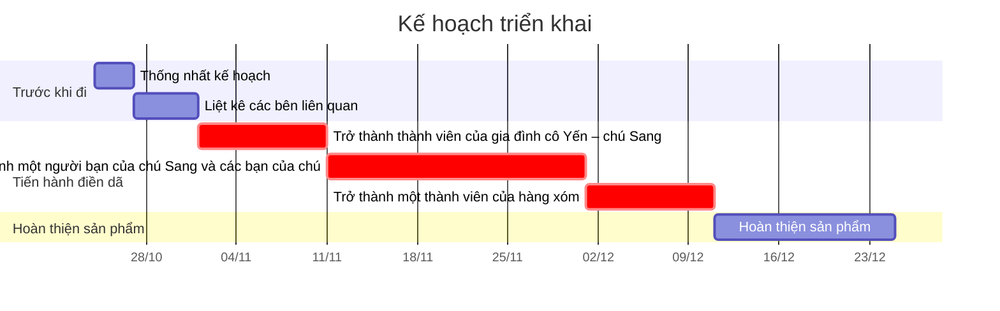

# Mục đích
Hiểu được:
- Các mâu thuẫn:
	- của má chồng với cô Yến,
	- giữa cô Yến và cô Hiền
- Cách gia đình cô quan niệm về:
	- chăm sóc vật nuôi,
	- việc hút thuốc lá của chú Sang 
- Cách gia đình cô và hàng xóm quan niệm về:
	- hát karaoke 

Những câu chuyện này sẽ giúp gợi ý cho một hệ thống quan điểm của một bộ phận người bình dân thành thị.

# Hình thức và cấu trúc sản phẩm
Trước mắt do chưa thấy được nhiều liên kết giữa các vấn đề này nên hình thức tạm thời sẽ là những câu chuyện lẻ độc lập với nhau. Để tránh việc mô tả lại có tính uy quyền diễn giải quá lớn, những đoạn thông tin nào đến từ lời của nhân vật sẽ được trích lại. Hình thức trích dẫn sẽ là [[In nghiêng câu trích dẫn thay vì để vào trong ngoặc kép làm câu văn tự nhiên hơn|in nghiêng thay vì để vào trong ngoặc kép. Điều này sẽ làm câu văn tự nhiên hơn, như cách mà bài viết *Đường tới Bờ Rạ* của Andrew Hardy đã áp dụng.]]

# Phương pháp thực hiện
Tiếp cận và trò chuyện với các nhân vật có liên quan càkng nhiều càng tốt. Một khó khăn trong việc thực hiện là làm sao để các nhân vật cởi mở và thoải mái khi nói về những vấn đề này. Nếu có thể đem quan điểm của mỗi người đi đối thoại với nhau thì càng tốt.

[[❓Người ta ngại không muốn từ chối thì mình có tiến tới ko]]
[[❓Khi nào thì một người sẽ cởi mở và thoải mái nói về những thứ họ không muốn nói]]
[[❓Nếu trước khi xin làm nghiên cứu mình họ đã có sự không thoải mái với mình rồi thì sao]]
[[❓Quan sát tham dự có yêu cầu họ tập trung nói về một chủ đề nào đó không]]
[[❓Để một quan sát có chất lượng thì cần bao nhiêu thời gian ở cùng cộng đồng]]

| Chủ đề                                                       | Thành phẩm cần có | Tài liệu liên quan           | Người được phỏng vấn                                                                                                                                                          |
| ------------------------------------------------------------ | ----------------- | ---------------------------- | ----------------------------------------------------------------------------------------------------------------------------------------------------------------------------- |
| Mâu thuẫn của má chồng với cô Yến                            |                   |                              | <li>Cô Yến, chú Sang</li><li>Ba má chú Sang (nếu còn sống)</li><li>Các anh chị em của chú Sang</li><li>Anh chị em cô Yến, đặc biệt là người em gái đã khuyên cô theo đạo</li> |
| Mâu thuẫn giữa cô Yến và cô Hiền                             |                   | Các giấy tờ về việc chi tiền | <li>Cô Yến, chú Sang, cô Hà(?)</li><li>Cô Hiền</li><li>Các cán bộ nhà nước liên quan</li>                                                                                     | 
| Cách gia đình cô quan niệm về chăm sóc vật nuôi              |                   |                              | <li>Các thành viên trong nhà cô Yến</li><li>Bác sĩ thú y</li><li>Những người bảo vệ quyền lợi động vật</li><li>Hàng xóm</li>                                                  |
| Cách gia đình cô quan niệm về việc hút thuốc lá của chú Sang |                   | Số tiền chi cho thuốc lá     | <li>Các thành viên trong nhà cô Yến</li><li>Những người bạn của chú Sang mà cũng hút thuốc lá</li>                                                                            |
| Cách gia đình cô và hàng xóm quan niệm về hát karaoke        |                   |                              | <li>Các thành viên trong nhà cô Yến</li><li>Các hộ dân xung quanh</li>                                                                                                        |

- Nhập gai
- Trở thành người thân
- 
