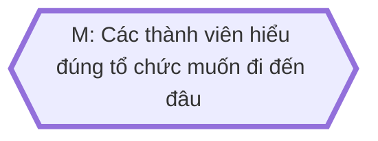
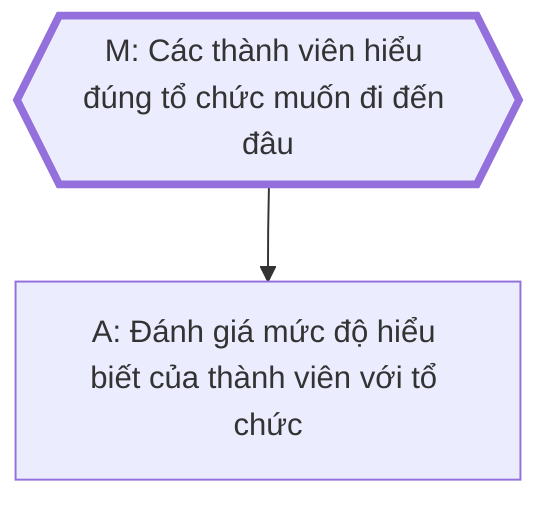
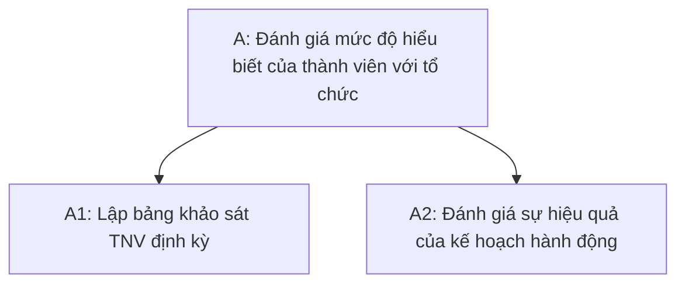
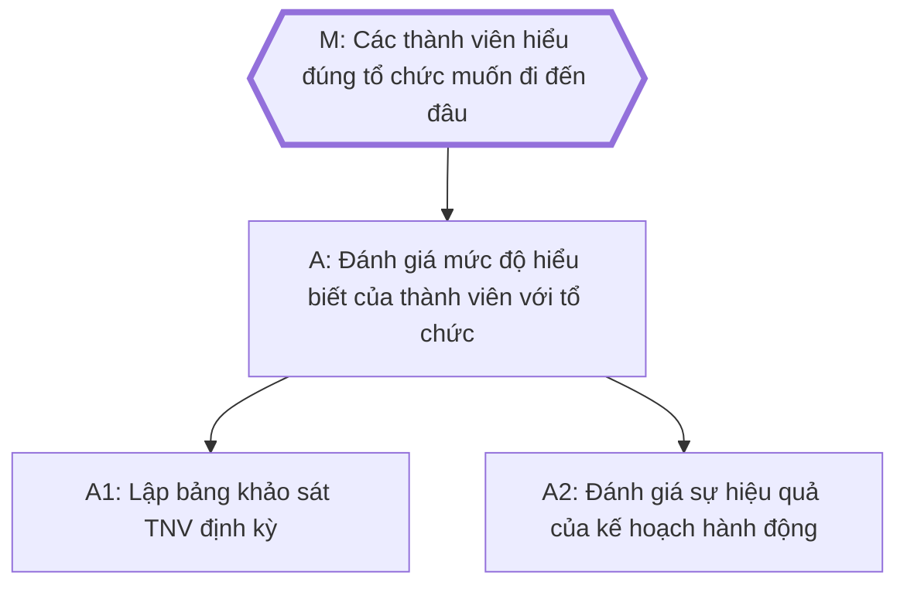
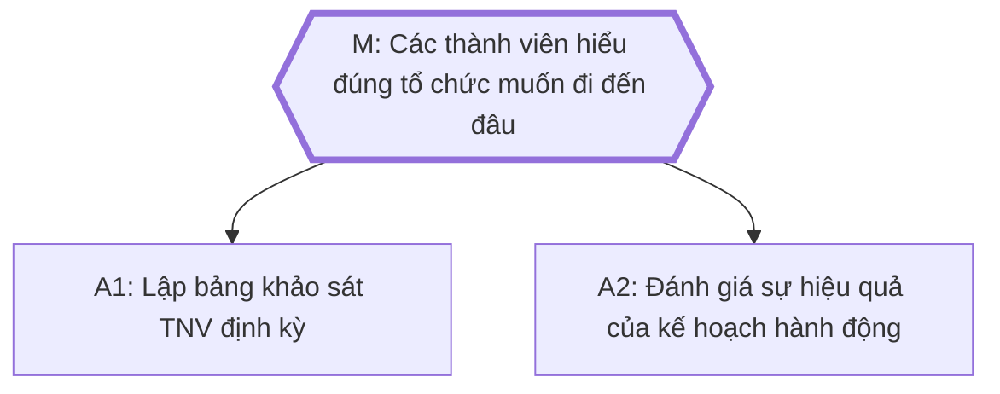

Khái niệm:: [[Công việc]], [[Cấu trúc]]

| Khía cạnh                                                           | Công việc khai phá (exploration)                                                                                                                                                           | Công việc khai thác (exploitation)                                                                                                                                                                                                                    |
| ------------------------------------------------------------------- | ------------------------------------------------------------------------------------------------------------------------------------------------------------------------------------------ | ----------------------------------------------------------------------------------------------------------------------------------------------------------------------------------------------------------------------------------------------------- |
| Tên gọi khác                                                        | Công việc khám phá                                                                                                                                                                         | Công việc quy trình                                                                                                                                                                                                                                   |
| Dạng bài toán                                                       | Không dễ để mô tả nó một cách rõ ràng. Thường là một công việc vẫn còn đang làm lần đầu và chưa hoàn thành. Sự thay đổi phương pháp trong quá trình làm gần như chắc chắn. Unknown unknown | Chỉ cần nói một lần là ai cũng hiểu. Là một danh sách/quy trình các tác vụ cụ thể (task), bước thực hiện (step) hoặc đơn vị công việc (unit) đã được khám phá đầy đủ và chỉ cần thực hiện. Ít xảy ra việc thay đổi trong quá trình làm. Known unknown |
| Kết quả đầu ra                                                      | Chưa làm xong thì cũng không chắc lắm kết quả trông như thế nào                                                                                                                            | Chưa làm cũng biết chính xác kết quả trông như thế nào                                                                                                                                                                                                |
| Thường có trong giai đoạn                                           | Lên chiến lược                                                                                                                                                                             | Thực thi chiến lược                                                                                                                                                                                                                                   |
| Sự chiếm dụng tâm trí                                               | Chỉ cần bị phân tâm một tí là mất mạch suy nghĩ ngay. Phải dồn toàn lực để làm. Thiên về hệ thống 2 (tư duy chậm)                                                                          | Bị phân tâm một tí cũng không sao. Làm lai rai không phải là vấn đề. Thiên về hệ thống 1 (tư duy nhanh)                                                                                                                                               |
| Mối quan hệ tới các thực thể khác*                                  | Kết nối trực tiếp tới một hoặc nhiều mục tiêu, và cũng có thể là một thành phần của một hoặc nhiều công việc khai phá khác                                                                 | Thường là một thành phần của một công việc khai phá nào đó, hiếm khi là thành phần của nhiều công việc khác hoặc kết nối trực tiếp tới mục tiêu                                                                                                       |
| Có phải là câu trả lời cho câu hỏi "Giờ bạn đang cần làm gì" không? | Có                                                                                                                                                                                         | Không                                                                                                                                                                                                                                                 |
| Sử dụng loại tư duy                                                 | Rhizome/phi tuyến tính                                                                                                                                                                     | Rễ cọc/tuyến tính                                                                                                                                                                                                                                     |
| Kiểu dữ liệu                                                        | Phi cấu trúc                                                                                                                                                                               | Cấu trúc                                                                                                                                                                                                                                              |
| Ví dụ                                                               | Xây dựng nhóm                                                                                                                                                                              | Thêm chức năng của vault, thiết kế, dịch                                                                                                                                                                                                              |

Việc phân chia công việc theo kiểu công việc cấp ban, công việc cấp tiểu ban, công việc cấp cá nhân, công việc thành phần có vẻ khó.

## \*Ví dụ về mối quan hệ với các thực thể (entity) khác
Ở bảng trên, phần *Mối quan hệ tới các thực thể khác* của công việc khai phá được ghi là:
> Kết nối trực tiếp tới một hoặc nhiều mục tiêu, và cũng có thể là một thành phần của một hoặc nhiều công việc khai phá khác

Điều này có nghĩa là gì?

Ví dụ ta có mục tiêu *Các thành viên hiểu đúng tổ chức muốn đi đến đâu*. Gọi M là mục tiêu này:

Để đạt được M, ta cần làm công việc khai phá A:

Tức là A đang đính trực tiếp vào M. 

Khi suy nghĩ cách để làm A ta thấy rằng cần phải chia A thành 2 công việc nhỏ hơn, A1 và A2: 

Giờ, ta có thể đính A1 và A2 gián tiếp vào M:

Hoặc trực tiếp vào M đều được:

Tuy việc này sẽ làm cây mục tiêu đồ sộ hơn so với chỉ đính A vào M, nhưng nó cũng minh hoạ cho việc sau khi nhìn thấy được các công việc khai phá thành phần của một công việc khai phá, thì ta cũng có thể đính trực tiếp nó vào mục tiêu như thể ta không cần phải nghĩ gì đến công việc khai phá ban đầu. Trong khi với công việc khai thác thì ta không làm được vậy. 

%%Dù sao thì nó cũng không có cảm giác đồ sộ bằng việc (khúc này quên ý)%%
## Xem thêm
- [[Áp lực giết chết sự sáng tạo]]
- [[Học là quá trình cấu trúc hoá những thứ phi cấu trúc]]
- [[Hệ thống 1 dựa vào trí nhớ dài hạn. Hệ thống 2 dựa vào trí nhớ ngắn hạn]] 
- [[Người người vạch chiến lược hay nhiều khi được giao triển khai luôn, hoặc người làm chuyên môn tốt nhiều khi được đề bạt lên làm quản lý, lãnh đạo]]
- [[Những công việc không đòi hỏi sự tập trung cao độ]]
- [[Điều đã biết là đã biết được dùng để lên kế hoạch chính. Điều không biết là đã biết được dùng để lên kế hoạch dự phòng. Điều đã biết là không biết thì cần nghiên cứu thêm]]

Khái niệm:: [[Hệ phức hợp]]
[[Tổ chức phi tập trung]]
## Sự cân bằng giữa exploration và exploitation
Sự khám phá những cái mới làm giảm tốc độ cải thiện kỹ năng sử dụng cái cũ. Việc competences của quy trình hiện tại được cải thiện làm việc thử nghiệm cái mới kém hấp dẫn hơn
Trong ngôn ngữ của những mô hình về tiến hóa tổ chức và công nghệ thì vấn đề này được frame là sự cân bằng giữa biến thể và lọc lựa. Because of the links among environmental turbulence, organizational diversity, and competitive advantage,the evolutionary dominance of an organizational practice is sensitive to the relation between the rate of exploratory variation created by the practice and the rate of change in the environs. 
