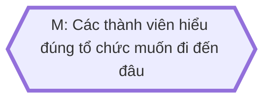
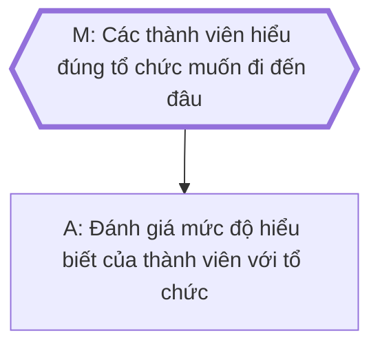
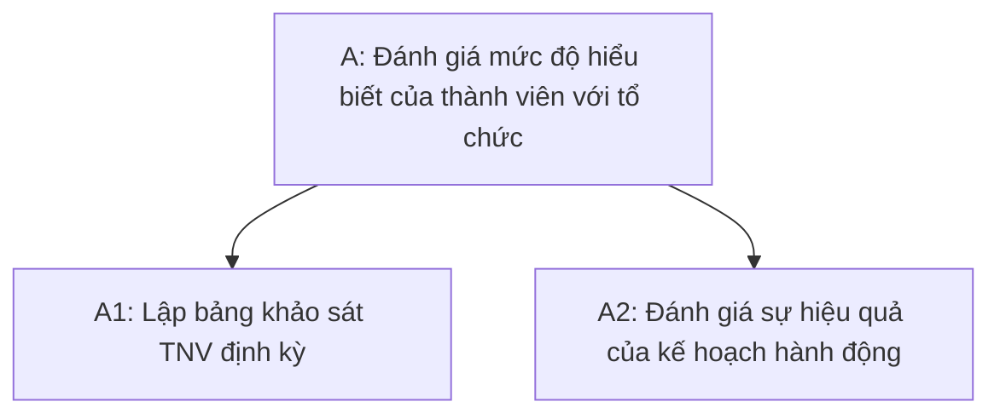
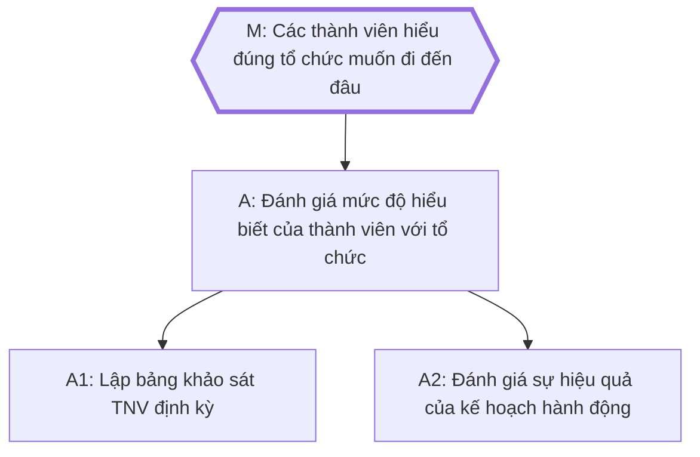
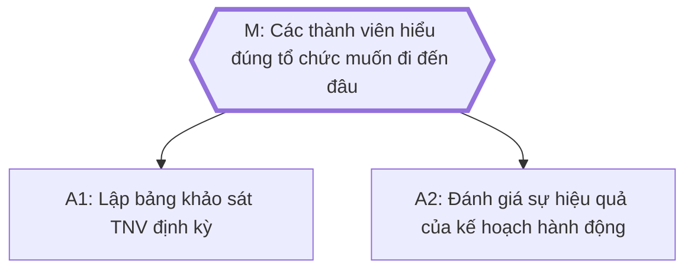

| Khía cạnh                                                           | Công việc khai phá (exploration)                                                                                                                                          | Công việc khai thác (exploitation)                                                                                                                                                                                                     |
| ------------------------------------------------------------------- | ------------------------------------------------------------------------------------------------------------------------------------------------------------------------- | -------------------------------------------------------------------------------------------------------------------------------------------------------------------------------------------------------------------------------------- |
| Dạng bài toán                                                       | Không dễ để mô tả nó một cách rõ ràng. Thường là một công việc vẫn còn đang làm lần đầu và chưa hoàn thành. Sự thay đổi phương pháp trong quá trình làm gần như chắc chắn | Chỉ cần nói một lần là ai cũng hiểu. Là một danh sách/quy trình các tác vụ cụ thể (task), bước thực hiện (step) hoặc đơn vị công việc (unit) đã được khám phá đầy đủ và chỉ cần thực hiện. Ít xảy ra việc thay đổi trong quá trình làm |
| Kết quả đầu ra                                                      | Chưa làm xong thì cũng không chắc lắm kết quả trông như thế nào                                                                                                           | Chưa làm cũng biết chính xác kết quả trông như thế nào                                                                                                                                                                                 |
| Sự chiếm dụng tâm trí                                               | Chỉ cần bị phân tâm một tí là mất mạch suy nghĩ ngay. Phải dồn toàn lực để làm. Hệ thống 1                                                                                | Bị phân tâm một tí cũng không sao. Làm lai rai không phải là vấn đề. Hệ thống 2                                                                                                                                                        |
| Mối quan hệ tới các thực thể khác*                                  | Kết nối trực tiếp tới một hoặc nhiều mục tiêu, và cũng có thể là một thành phần của một hoặc nhiều công việc khai phá khác                                                | Thường là một thành phần của một công việc khai phá nào đó, hiếm khi là thành phần của nhiều công việc khác hoặc kết nối trực tiếp tới mục tiêu                                                                                        |
| Có phải là câu trả lời cho câu hỏi "Giờ bạn đang cần làm gì" không? | Có                                                                                                                                                                        | Không                                                                                                                                                                                                                                  |
| Ví dụ                                                               | Xây dựng nhóm                                                                                                                                                             | Thêm chức năng của vault, thiết kế, dịch                                                                                                                                                                                               |
| Sử dụng loại tư duy                                                 | Rhizome/phi tuyến tính                                                                                                                                                    | Rễ cọc/tuyến tính                                                                                                                                                                                                                      |
| Kiểu dữ liệu                                                        | Phi cấu trúc                                                                                                                                                              | Cấu trúc                                                                                                                                                                                                                               |
| Tên gọi khác                                                        | Khám phá                                                                                                                                                                  | Quy trình                                                                                                                                                                                                                              |

Trước đây có chia ra công việc cấp ban, công việc cấp tiểu ban, công việc cấp cá nhân, và  công việc thành phần, nhưng giờ bỏ.

# \*Ví dụ về mối quan hệ với các thực thể (entity) khác
Xét một mục tiêu/thành quả cần có M: 

Để đạt được M, ta cần làm công việc khai phá A:

Tức là A đang đính trực tiếp vào M. 

Khi suy nghĩ cách để làm A ta thấy rằng cần phải chia A thành 2 công việc nhỏ hơn, A1 và A2: 

Giờ, ta có thể đính A1 và A2 gián tiếp vào M:

Hoặc trực tiếp vào M đều được:

Tuy việc này sẽ làm cây mục tiêu đồ sộ hơn so với chỉ đính A vào M, nhưng nó cũng minh hoạ cho việc sau khi nhìn thấy được các công việc khai phá thành phần của một công việc khai phá, thì ta cũng có thể đính trực tiếp nó vào mục tiêu như thể ta không cần phải nghĩ gì đến công việc khai phá ban đầu. Trong khi với công việc khai thác thì ta không làm được vậy. 

%%Dù sao thì nó cũng không có cảm giác đồ sộ bằng việc (khúc này quên ý)%%
[[Công việc khai phá chính là quản lý kiến thức]]
[[Áp lực giết chết sự sáng tạo]]
[[Chỉ có thể ước lượng được thời gian cần có để hoàn thành khi công việc của ta gần như chỉ gồm công việc khai thác]]
[[Học là quá trình cấu trúc hoá những thứ phi cấu trúc]]