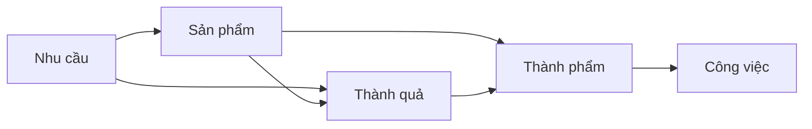

[[Dựa vào KPI thì business là người có tiếng nói lớn nhất. Đội phát triển sản phẩm rất ít có tiếng nói]]
[[Thành quả (outcome) là kết quả mà chúng ta thu được do sự thay đổi về hành vi của người dùng khi tương tác với sản phẩm đã được cải tiến (hoặc sản phẩm mới)]]

 

