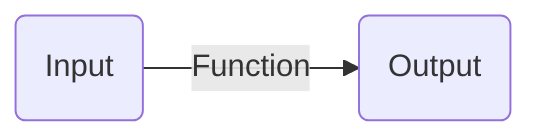

Câu hỏi liên quan đến chủ đề này:
```dataview
List from "3 Kiến thức, câu hỏi/32 Câu hỏi" where contains(chủ-đề,[[]]) 
```

Chủ đề quan tâm đến chủ đề này:
```dataview
List from "3 Kiến thức, câu hỏi/31 Khái niệm" where contains(chủ-đề,[[]]) 
```
Chủ đề:: [[Tổ chức phi trung tâm]]

Chức năng, nhiệm vụ chính là quá trình (process) trong bối cảnh tổ chức


