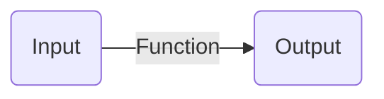

Câu hỏi liên quan đến chủ đề này:
```dataview
List from "3 Kiến thức, câu hỏi/32 Câu hỏi" where contains(khái-niệm,[[]]) 
```

Chủ đề quan tâm đến chủ đề này:
```dataview
List from "3 Kiến thức, câu hỏi/31 Khái niệm" where contains(khái-niệm,[[]]) 
```
Khái niệm:: [[Tổ chức phi tập trung]]

Chức năng, nhiệm vụ chính là quá trình (process) trong bối cảnh tổ chức


