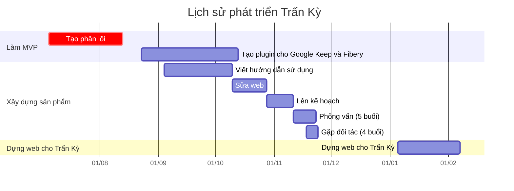

# Điều nhà đầu tư quan tâm
## Trấn Kỳ là gì
Trấn Kỳ là một chương trình tự động phân loại, gắn nhãn thông tin theo thói quen và cách sắp xếp của riêng bạn bằng tiếng Việt tự nhiên, và có thể tích hợp được vào hệ thống vận hành hiện tại của bạn như báo cáo ngân hàng, Google Keep, Google Sheet, Notion, Obsidian, Fibery, Odoo, v.v.

Ví dụ, với câu nhập đầu vào là:

```
thăn bò 30k lườn gà 20k (giảm giá) cho Parid ở coopmart vợ trả
```

Kết quả đầu ra sẽ là:

| Tên                         | Giá trị          |
| --------------------------- | ---------------- |
| Món đồ                      | thăn bò, lườn gà |
| Loại món đồ                 | Lương thực       |
| Phương thức thanh toán      | vợ trả           |
| Loại phương thức thanh toán | Tiền mặt         |
| Nơi mua                     | CoopMart         |
| Loại nơi mua                | Siêu thị         |
| Người thụ hưởng             | Parid            |
| Loại người thụ hưởng        | Gia đình         |
| Số tiền                     | 50000            |
| Ghi chú                     | giảm giá         |

Ngoài ra bạn còn có thể dùng nó để phân loại nhiều thứ khác. Ví dụ:
- **Ý tưởng**: `Kĩ thuật viết văn %topic_Writing @tác_giả_a`
- **Mối quan hệ**: `Gặp @ông_A bàn về việc X, có đi ăn ở !nhà_hàng_Y 200k ck vcb`
- **Công việc**: `Công việc A cần giao cho @bạn_B liên hệ với @@đối_tác_C tại !quán_D với chi phí dự kiến 300k ck vcb và nhận output &&item_X`
- **Cảm xúc**: `xem phim:Inception thấy chấn động`
- **Sức khoẻ:** `chạy bộ 100m, hít đất 30 cái`

## Tiềm năng thị trường
Theo nhóm tìm hiểu thì Trấn Kỳ là chương trình duy nhất hiện nay ở Việt Nam giúp phân loại dữ liệu một cách tự động mà dễ tiếp cận với mọi người. ChatGPT thì thực ra cũng có thể làm được, nhưng Trấn Kỳ có những ưu điểm mà ChatGPT không thể sánh được: đảm bảo chính xác 100% theo phân loại người dùng, không cần kết nối mạng khi chạy, không cần gửi dữ liệu ra bên ngoài, chạy số lượng lớn nhanh và rẻ.

Trong lĩnh vực tài chính cá nhân, với những app hiện có, ví dụ như MoneyLover, thì sau 5 năm hoạt động vẫn chỉ có 50k download, chứng tỏ nó vẫn còn quá bé, vẫn chưa chiếm lĩnh được thị trường. Ngoài ra, việc phân loại chi tiêu cũng là bước đầu tiên để một người gia nhập thị trường tài chính. Nó có thể giúp các ngân hàng tiếp cận những người không dùng tài khoản ngân hàng (nhóm unbanked). Nhất là với nhóm đối tượng học sinh, khi họ chưa đủ 18 tuổi để mở tài khoản ngân hàng. Đây là một mỏ dữ liệu cho các nhà đầu tư.

## Lịch sử phát triển


## Khám phá sâu về người dùng
Có những người sử dụng chương trình này không chỉ để phân loại thu chi, mà còn để phân loại các loại dữ liệu khác, cũng như kết hợp vào hệ thống hoạch định tài nguyên doanh nghiệp của họ.

Bài chi tiết: [[Lý do viết Trấn Kỳ]]{ .md-button .md-button--primary }

## Mô hình kinh doanh
Dự kiến những người có nhu cầu phân loại dữ liệu lớn nhất là:
- Những doanh nghiệp vừa và nhỏ
- Những nhà nghiên cứu hoặc làm dự án xã hội mới được cấp quỹ làm dự án

Đặc điểm chung của nhóm này là:
1. dữ liệu của họ đủ lớn và quy trình đủ phức tạp để họ phải có một hệ thống xử lý dữ liệu mà các sản phẩm no-code không đáp ứng được, nhưng 
2. nguồn lực cũng đủ nhỏ để không đủ tiền thuê lập trình viên cho mình và không đủ thời gian để tự học lập trình

Thế nên hiện tại nhóm đang mở các buổi hỗ trợ các đối tượng này giải quyết nhu cầu công việc thông qua việc hướng dẫn lập trình để thu hút họ. Trong tương lai khi có thêm nhân lực thì có thể suy nghĩ thêm những cách làm sau:
- SaaS: tính theo số lượng truy vấn hoặc plugin
- Bán dữ liệu
- Gia công cho các công ty
- Quảng cáo

Bài chi tiết: [[Mô hình kinh doanh Trấn Kỳ|Mô hình kinh doanh Trấn Kỳ]]{ .md-button .md-button--primary }

## Đội ngũ
Hiện tại nhóm có 1 người làm toàn thời gian ở tất cả các vấn đề (nghiên cứu, lập trình, truyền thông, phỏng vấn, v.v.) và 1 người làm quản lý kiêm nhân sự. Ngoài ra còn có 2 người khác cũng quan tâm và thường xuyên cho đóng góp. Tất cả đều đã làm việc với nhau hơn 2 năm cùng Quả Cầu.

# Điều muốn nhà đầu tư quan tâm
## Trấn Kỳ được sinh ra là để giúp Kendy
Giúp đỡ Kendy là điều kiện tiên quyết để nhóm xem xét đề nghị đầu tư của bạn. Bạn không cần phải quan tâm đến Kendy, chỉ cần nhóm thấy được đề nghị đầu tư của bạn có lợi nhất cho Kendy thì nhóm sẽ đồng ý.
[[Lý do viết Trấn Kỳ]], [[Kế hoạch giúp đỡ người đang kiệt quệ vì nợ]]

## [[Người dùng hài lòng với chất lượng sản phẩm, không phải tốc độ làm ra nó]] 
- [[Đa số startup không chết vì cạnh tranh với đối thủ, mà vì không có người dùng sản phẩm của mình]]
- [[Dựa vào KPI thì bộ phận kinh doanh sẽ có tiếng nói lớn nhất, còn đội phát triển sản phẩm rất ít có tiếng nói]]
- [[Thứ quyết định hiệu quả của việc kinh doanh là văn hoá doanh nghiệp và phản ứng của thị trường về mình]]
- [[Việc ưu tiên ra quyết định nhanh làm ta thấy thảo luận và dành thời gian xây dựng kế hoạch và nghiên cứu là phí thời gian]]
- [[Áp lực giết chết sự sáng tạo]]
- [[When someone's taking time to do something right in the present, they're a perfectionist with no ability to prioritize, whereas when someone took time to do something right in the past, they're a master artisan of great foresight]]
- [[Nếu bạn nghĩ rằng bạn có thể hoàn thành đúng kế hoạch, có thể bạn đang ngộ nhận]]
- [[Việc mất tiền làm tâm lý con người bị đau dù có thể nó vô lý]]
- [[Nỗi ám ảnh với sự hiệu quả có thể đến từ nỗi sợ chết]]
- [[Việc thuê ngoài chỉ giải quyết được một lần, trong khi phải thử rất nhiều lần]]
## Sức khoẻ cũng là một loại tài nguyên cần được tối ưu hoá
- [[Phân tích quyết định đa tiêu chí (MCDA) là phương pháp để tìm điểm đánh đổi tối ưu nhất]] 

## Động lực nội sinh và sự tin tưởng tạo ra tổ chức đáng làm
- [[Nhìn thấy được người kia đang làm gì làm tăng sự tin tưởng đối với họ]]
- [[Một tổ chức đáng làm tạo ra được động lực nội sinh ở nhân viên]]

## Quả Cầu là một vùng đất, một sân chơi, một cộng đồng, một mạng lưới, một nền tảng, một hệ sinh thái
Nó là một khái niệm lơ lửng, một vật thể trong suốt. Quả Cầu hướng đến việc trở thành một tổ chức không có sự phân cấp và người tham gia không làm vì trách nhiệm, lấy nhu cầu của thành viên (vốn nhiều vô kể và thay đổi liên tục) làm mục tiêu của tổ chức, để họ trở thành những người có kỹ năng đa dạng, tư duy liên ngành, và sự khoẻ mạnh và hạnh phúc toàn diện, dựa trên triết học của Deleuze và Guattari, khoa học phức hợp, game phiêu lưu nhập vai, nền kinh tế không dùng tiền, và các công cụ lưu dữ liệu tại máy người dùng.