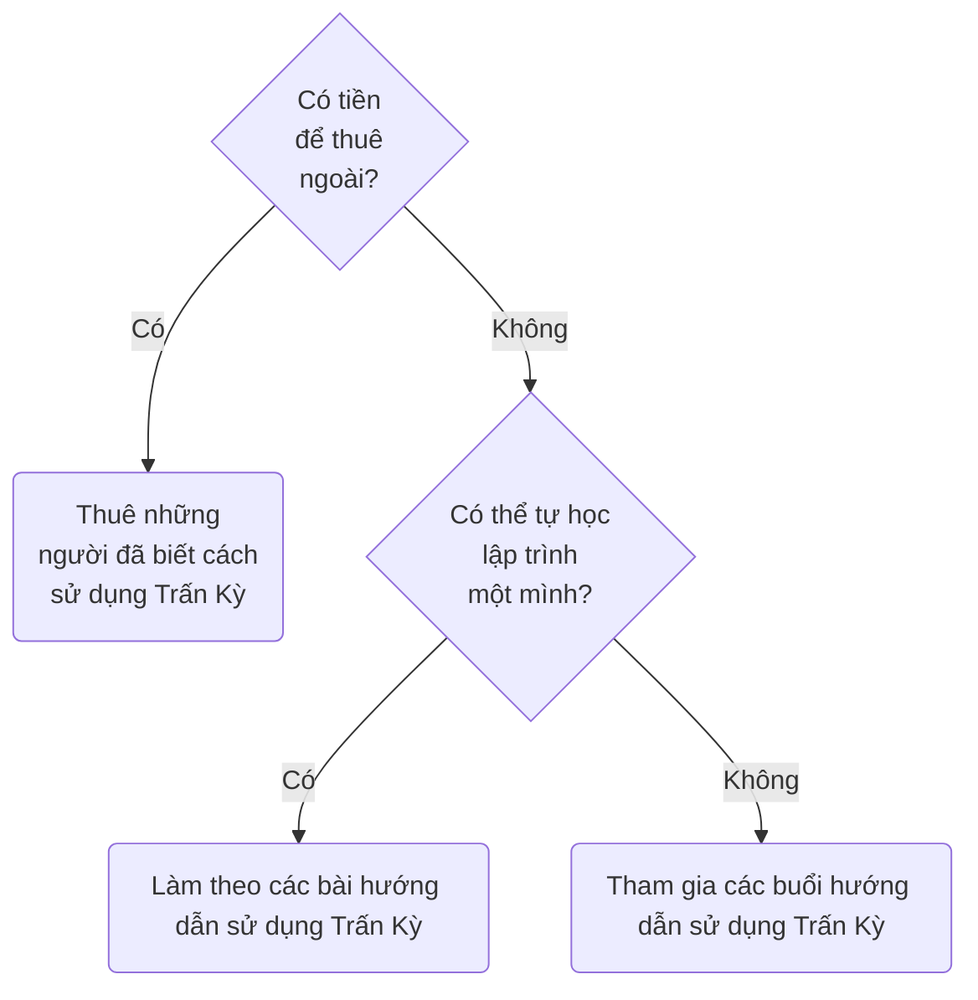

# Ai sẽ dùng Trấn Kỳ? Ai sẽ không dùng?
[[Lý do viết Trấn Kỳ|Trấn Kỳ viết ra là cho Kendy]], nên chắc chỉ những Kendy khác mới cần. Họ là những người bị dày vò hằng ngày khi tất cả những giải pháp họ biết tới đều yêu cầu họ phải phân loại ngay lúc nhập dữ liệu. Họ đã mường tượng được rằng thứ họ cần vượt quá khả năng đáp ứng của các sản phẩm no-code, và chỉ có con đường lập trình mới giải quyết được. Éo le là họ có đủ chuyện phải lo để việc dành thời gian tự học lập trình là bất khả, và đủ thứ phải chi để việc dành tiền thuê lập trình viên là bất khả.

Nếu bạn là một người như vậy thì có nghĩa là bạn đã bị dồn nén quá lâu rồi. Bọn mình nghĩ việc viết một email để kể về tình trạng của bạn là quá đơn giản, chỉ cần khơi một chút thôi thì chữ nghĩa sẽ tuôn ra như thác đổ. Vì Trấn Kỳ được sinh ra dành cho những người như bạn, nên Trấn Kỳ sẽ là của bạn.

Còn nếu bạn không thấy mình bị dày vò đến mức đó thì có lẽ bạn là một người dùng tiềm năng, đủ quan tâm để hỏi bọn mình một vài thứ, đủ hứng thú để đọc các bài viết liên quan (như bài này), nhưng chưa đủ để làm tất cả mọi thứ trong khả năng để có Trấn Kỳ. Có thể thỉnh thoảng bạn cũng thấy ức chế, khó chịu khi phải phân loại thủ công ngay lúc nhập liệu, nhưng sự khó chịu đó chưa đủ dồn nén để đưa việc viết một email như vậy lên ưu tiên hàng đầu. Khi nào tiện hơn thì bạn sẽ làm.

Xem thêm:: [[Điều quan trọng thì thường hiếm khi khẩn cấp, và điều khẩn cấp thì thường hiếm khi quan trọng]]

# Ai sẽ trả tiền?
Với những doanh nghiệp lớn có đủ tiền để nuôi một đội lập trình riêng thì có khả năng họ đã tự làm được điều này rồi. Nên có lẽ những người có nhiều tiềm năng chi tiền nhất là những người vừa rất cần việc phân loại tự động những ý nghĩ trong đầu mình để cuối tuần có một báo cáo đáng tin cậy, có một số tiền cũng đủ thoải mái để chi nhưng không đủ tiền để thuê một lập trình viên hoặc đủ thời gian để chờ họ viết. (Bọn mình viết chương trình này trong hơn 2 tháng làm việc toàn thời gian và việc gọi điện thảo luận rất linh động không cần báo trước và có thể rất khuya. [[Viết phần mềm chỉ chiếm khoảng ⅓ thời gian, còn lại là dành cho bảo trì (thêm bớt chức năng, sửa lỗi, v.v.)]]). 

Những người có tiềm năng chi tiền nhất có lẽ là:
- Những người có một số vốn kiểu vài chục triệu để đầu tư kinh doanh, 
- Những người làm nghiên cứu hoặc làm dự án xã hội mới được cấp quỹ làm dự án

Nhưng có lẽ tốt nhất không phải là kiếm người sẵn sàng trả tiền, mà là giúp Kendy càng không phải chi tiền càng tốt. Điều này quay lại ý tưởng mạng kết nối nhu cầu. Xem thêm: [[Từ việc hỗ trợ Kendy đến Patreon và tâm lý của con người về tiền]].

# Bán vậy thì có còn là phần mềm mã nguồn mở hay tự do nữa không? 
Có, vì khái niệm mã nguồn mở hay tự do đều chỉ nói về quyền tái phân phối (redistribution) của người dùng, chứ vẫn cho phép tác giả tạo rào cản tiếp cận. Xem chi tiết: [Is it open source for allowing people who have access to the source act as if it's open source?](https://opensource.stackexchange.com/q/14357/6810)

# Vậy mua về xong rồi chia sẻ cho mọi người thì có được không?
Tất nhiên là được. Bọn mình còn khuyến khích bạn làm vậy, vì các bạn sẽ có thêm động cơ để mua chung. 
# Người khác ăn cắp ý tưởng thì sao? 
Những app quản lý tài chính như MoneyLover hay Misa chắc chắn sẽ bắt chước được tính năng này thôi. Ai có hiểu biết về lập trình nhìn vào cũng thấy đây chỉ là bắt regex chứ có gì đâu mà khó. Chịu khó bỏ thời gian ra để debug là được. Nên từ đầu việc giữ bí mật mã nguồn cũng không đem lại nhiều lợi thế cạnh tranh cho lắm. Cạnh tranh với bọn họ chỉ làm xao nhãng mục tiêu giúp Kendy. 

Như cũng đã nói trong [[Lý do viết Trấn Kỳ]], việc sử dụng những app như vậy làm dữ liệu bị cô lập. Nên nếu mà gọi là cạnh tranh với họ, thì sẽ là cạnh tranh ở điểm họ không làm: [[Bạn có quyền chỉnh sửa dữ liệu của mình dưới bất kỳ hình thức nào|sự tự do dữ liệu]]. Thị trường mà Trấn Kỳ có lợi thế cạnh tranh không phải là thị trường dành cho người cần quản lý chi tiêu cá nhân, mà là dành cho những người cần xây dựng hệ thống quản trị phù hợp với luồng làm việc và suy nghĩ đặc thù của họ. Họ là những người đã dùng qua những app như vậy rồi và thấy chúng quá chật hẹp với mình. Họ hiểu giới hạn của các sản phẩm hướng đến sự thuận tiện của người dùng bình thường và đã có nhu cầu lớn về học lập trình rồi. 

Chúng ta hay nghe báo chí nói về những thuật ngữ như chuyển đổi số, kinh tế số. Một trong những [[Sự khác nhau giữa công nghệ thông tin và chuyển đổi số]] là công nghệ thông tin cung cấp một công cụ để thực hiện tự động hoá một cách thức làm việc đã có sẵn. Không có máy tính thì làm lâu hơn, tốn công hơn, nhưng vẫn làm được. Còn chuyển đổi số triệt để hơn thế. Nó đòi hỏi ta phải chuyển đổi cả cách làm và tư duy làm việc. Những cách làm và tư duy mới này chỉ có thể khả thi khi máy tính được phát minh. Nói cách khác, không có máy tính thì không làm được chúng. Những app quản lý chi tiêu cá nhân kia tuy tiện thật, nhưng không có nó thì ta vẫn có thể làm được bằng tay. Còn sự lưu thông dữ liệu thì chỉ có máy tính mới làm được. Như vậy, các app đó chỉ mới là ứng dụng công nghệ thông tin trong việc thu chi, chứ không phải giải quyết nhu cầu chuyển đổi số của người sử dụng.

Trao cho người dùng sự tự do dữ liệu nghĩa là giúp họ tham gia vào [[Người không học về lập trình thấy việc lập trình như làm phép thuật|thế giới phép thuật của lập trình]], hoà mình vào dòng chảy của [[Kinh tế số là kinh tế dữ liệu (data-driven economy)|nền kinh tế số]]. Lợi thế cạnh tranh của bọn mình không phải là ở ý tưởng phân loại dữ liệu độc đáo hay là việc giữ được bí mật mã nguồn, mà nằm ở việc trao quyền cho người sử dụng.

Thực ra vẫn có những dự án mã nguồn mở được đầu tư mấy chục triệu đô như Langchain, Deno, Docker. Nên có khi nào việc có code không phải là vấn đề lớn thật?
trường hợp code quá dễ chắc tầm một tuần là làm được thì mới bị bắt chước, và như vậy thì mới không đáng để đầu tư. Tự thị trường cũng đã giải quyết được nhu cầu đó rồi. Chỉ khi nào tốn vài tháng để làm thì mới không đáng copy mà đáng đầu tư, vì nếu đi copy thì sẽ ko cạnh tranh được với một nhà đầu tư khác đầu tư luôn vào mình
[[Nhà đầu tư không ăn cắp ý tưởng vì phải cạnh tranh với các nhà đầu tư khác]]
# Mô hình hoạt động là gì?
Ở thị trường của những người cần xây dựng hệ thống quản trị phù hợp với luồng làm việc và suy nghĩ đặc thù của mình, người dùng sẽ cần phải biết cách kết hợp Trấn Kỳ vào hệ thống của mình. Hiện tại Trấn Kỳ đã có thể tích hợp được với Google Keep và Fibery; nếu họ dùng hệ thống khác họ sẽ phải tự lập trình, hoặc thuê ngoài, thứ mà họ đã hiểu và chấp nhận. Lúc này sẽ có ba khả năng:

| 💸Có tiền để thuê ngoài? | ⏳Có thể tự học lập trình một mình? | Giải pháp                                                                                                                                                                                                                                                                                                                                                                                                                                               |
| ------------------------ | ----------------------------------- | ------------------------------------------------------------------------------------------------------------------------------------------------------------------------------------------------------------------------------------------------------------------------------------------------------------------------------------------------------------------------------------------------------------------------------------------------------- |
| ❌                       | ✔                                   | Làm theo [các bài hướng dẫn sử dụng Trấn Kỳ](https://lậptrình.quảcầu.cc/%F0%9F%91%8FTr%E1%BA%A5n%20K%E1%BB%B3/H%C6%B0%E1%BB%9Bng%20d%E1%BA%ABn%20s%E1%BB%AD%20d%E1%BB%A5ng%20Tr%E1%BA%A5n%20K%E1%BB%B3/?utm_source=CW+Obsidian%2C+qu%E1%BA%A3n+l%C3%BD+d%E1%BB%B1+%C3%A1n+v%C3%A0+c%C3%B4ng+c%E1%BB%A5+ngh%C4%A9+%C2%BB+K%E1%BA%BF+ho%E1%BA%A1ch+ph%C3%A1t+tri%E1%BB%83n+Tr%E1%BA%A5n+K%E1%BB%B3&utm_medium=vault&utm_campaign=Tr%E1%BA%A5n+K%E1%BB%B3) |
| ❌                       | ❌                                  | Tham gia [[Kế hoạch tổ chức các buổi hướng dẫn sử dụng Trấn Kỳ\|các buổi hướng dẫn sử dụng Trấn Kỳ]]                                                                                                                                                                                                                                                                                                                                                    |
| ✔                        |                                     | Thuê những người đã biết cách sử dụng Trấn Kỳ                                                                                                                                                                                                                                                                                                                                                                                                           |

Bạn sẽ không thể thuê ngoài trên các chợ nước ngoài như [Fiverr](https://www.fiverr.com/ "Fiverr - Freelance Services Marketplace") hay [Upwork](https://www.upwork.com/ "Upwork | The World’s Work Marketplace") được, vì việc xử lý tiếng Việt có những thứ rất lắt nhắt mà chỉ có người Việt mới có thể hiểu và xử lý được. Chợ chuyên cho người Việt thì hiện nay hình như chỉ có mỗi [vLance](https://www.vlance.vn/ "Freelancer Việt Nam - Lựa chọn số 1 của doanh nghiệp - vLance.vn"). Tuy nhiên, như đã nói ở trên, bọn mình đã phải viết chương trình này trong hơn 2 tháng làm việc toàn thời gian và việc gọi điện thảo luận rất linh động không cần báo trước và có thể rất khuya. [[Viết phần mềm chỉ chiếm khoảng ⅓ thời gian, còn lại là dành cho bảo trì (thêm bớt chức năng, sửa lỗi, v.v.)]]. Nếu bạn có thể thuê được một lập trình viên từ đầu đã có kinh nghiệm thì có lẽ cũng phải mất 3 tuần làm việc liên tục. Nếu bạn thuê được người đã có sẵn một giải pháp cho việc phân loại câu nhập bằng tiếng Việt tự nhiên rồi thì chi phí cũng như thời gian chờ đợi sẽ giảm đi rất nhiều.

Vì từ đầu chỉ là những người đang có dự án để làm rồi mới tìm đến với Trấn Kỳ, nên sẽ không ai đến với nó để chỉ kiếm tiền. Để họ có thể chấp nhận đi cài Trấn Kỳ cho người khác thì việc đó phải đem lại những lợi ích khác như mối quan hệ, kiến thức, trải nghiệm và các cơ hội khác mà họ thấy phục vụ trực tiếp vào dự án của họ. Tức là, người thuê cần nhận thức được rằng tiền không phải là thứ duy nhất để tìm được người nhận làm, và họ cần phải chú trọng đến việc đem đến cho người nhận nhiều lợi ích khác. Nên mặc dù trên bề mặt đó có thể chỉ là thuê ngoài để gia công hệ thống, nhưng thực chất tiền và hệ thống quản trị không phải là những nhu cầu duy nhất được đáp ứng. Thậm chí, người nhận làm có thể làm miễn phí luôn, nếu họ có thể tin tưởng rằng họ chắc chắn sẽ nhận được nhiều thứ quan trọng hơn. Đó là điều mà vLance không làm được.

Điều đó cũng có nghĩa là, mặc dù cả người thuê và người nhận có thể lên những chợ thuê ngoài để rao tin, nhưng họ không có lý do gì để làm điều đó. Trấn Kỳ sẽ là nơi tốt nhất để họ tìm thấy được nhau. Trong hệ sinh thái này, những người thuê sẽ phải cạnh tranh với nhau bằng lợi ích họ có thể cho người nhận, chứ không phải người nhận phải cạnh tranh với nhau bằng mức giá.

# Trấn Kỳ khác các đối thủ cạnh tranh chỗ nào?
- Những người muốn nhập liệu bằng những phương thức của mình cũng có thể tham gia
- Những người muốn phân loại những thứ không phải là chi tiêu cũng có thể tham gia
- Những người không có nhu cầu phân loại cũng có những lý do khác để tham gia

# Những lý do để người không có nhu cầu phân loại tham gia là gì?
Những người thỉnh thoảng cũng thấy ức chế, khó chịu khi phải phân loại thủ công ngay lúc nhập liệu, nhưng sự khó chịu đó chưa đủ dồn nén để làm tất cả mọi thứ trong khả năng để có Trấn Kỳ là những người dùng tiềm năng. Họ đủ quan tâm để hỏi bọn mình một vài thứ, đủ hứng thú để đọc các bài viết liên quan (như bài này), và... hết. Những bài viết đó đã thoả mãn được nhu cầu của họ; [[Sau khi nhu cầu được giải quyết xong ta sẽ nghĩ ngay tới việc giải quyết vấn đề tiếp theo|sau khi nhu cầu được giải quyết xong họ sẽ nghĩ ngay tới việc giải quyết vấn đề tiếp theo đang nảy ra trong đầu họ]]. [[Việc giúp đỡ người đã giúp mình không đủ khẩn cấp hoặc nhiều cảm hứng bằng việc giải quyết vấn đề tiếp theo, hoặc đủ cảm hứng bằng việc cải tiến giải pháp hiện có|Những thứ đó khẩn cấp hoặc nhiều cảm hứng hơn.]]

Nhưng nếu sản phẩm này còn có thể giúp họ nhiều hơn thế, thì họ sẽ thấy việc tham gia có lý hơn. Đây là những cách giúp tạo ra lý do đó cho họ:

| Khách hàng tiềm năng                                       | Nhu cầu/điểm đau                                                                                                                                                                                                                                                                                  | Điều họ nhận được                                                                                                                                                                                          | Giả thiết                                                                                                                                                                                                                                    | Thành phẩm                                                                                                                                                                                                                                                                                                                                                                                                                                                                                                                                                                                                                                                                                                                                                                                                                                                    |
| ---------------------------------------------------------- | ------------------------------------------------------------------------------------------------------------------------------------------------------------------------------------------------------------------------------------------------------------------------------------------------- | ---------------------------------------------------------------------------------------------------------------------------------------------------------------------------------------------------------- | -------------------------------------------------------------------------------------------------------------------------------------------------------------------------------------------------------------------------------------------- | ------------------------------------------------------------------------------------------------------------------------------------------------------------------------------------------------------------------------------------------------------------------------------------------------------------------------------------------------------------------------------------------------------------------------------------------------------------------------------------------------------------------------------------------------------------------------------------------------------------------------------------------------------------------------------------------------------------------------------------------------------------------------------------------------------------------------------------------------------------- |
| Người làm phát triển sản phẩm, khởi nghiệp, dự án          | <ol><li>Việc phải phân loại dữ liệu thủ công lấy đi thời gian để làm những việc ở cấp độ cao hơn như lập kế hoạch, sáng tạo nội dung</li><li>Thấy rằng không phải lúc nào tiền cũng là giải pháp cho mọi vấn đề nhưng không biết phải thoát ra khỏi nó/làm nó tuyệt vời hơn như thế nào</li></ol> | <ol><li>Sự phân loại các giả thiết và nhu cầu của các bên liên quan một cách nhanh chóng, chính xác và rẻ hơn AI</li><li>Một dự án mở từ đầu đến cuối vẫn có thể tạo ra sự bền vững về tài chính</li></ol> | <ol><li>Có thể phân loại ý tưởng, giả thuyết, khám phá về người dùng, các bên liên quan theo một hệ thống phân loại cố định</li><li>Điều phối được các dòng chảy nhu cầu để chúng tự đáp ứng được với nhau</li></ol>                         | <ol><li>Cách Kendy/Quả Cầu đã tự động hoá việc phân loại ý tưởng như thế nào</li><li>Mạng kết nối nhu cầu</li></ol>                                                                                                                                                                                                                                                                                                                                                                                                                                                                                                                                                                                                                                                                                                                                           |
| Người có những yêu cầu quản lí tài chính phức tạp          | Có nhiều nguồn doanh thu, giao dịch mà việc phân loại vào tại thời điểm đó rất nhức đầu                                                                                                                                                                                                           | Không cần phải phân loại dữ liệu thủ công mà vẫn có báo cáo giao dịch đáng tin cậy                                                                                                                         | Họ thiết lập được Trấn Kỳ                                                                                                                                                                                                                    | [Giới thiệu về Trấn Kỳ](https://lậptrình.quảcầu.cc/%F0%9F%91%8FTr%E1%BA%A5n%20K%E1%BB%B3/?utm_source=CW+Obsidian%2C+qu%E1%BA%A3n+l%C3%BD+d%E1%BB%B1+%C3%A1n+v%C3%A0+c%C3%B4ng+c%E1%BB%A5+ngh%C4%A9+%C2%BB+K%E1%BA%BF+ho%E1%BA%A1ch+ph%C3%A1t+tri%E1%BB%83n+Tr%E1%BA%A5n+K%E1%BB%B3&utm_medium=vault&utm_campaign=Tr%E1%BA%A5n+K%E1%BB%B3&utm_content=th%C3%A0nh+ph%E1%BA%A9m), [Hướng dẫn sử dụng Trấn Kỳ](https://lậptrình.quảcầu.cc/%F0%9F%91%8Ftr%E1%BA%A5n%20k%E1%BB%B3%2Fh%C6%B0%E1%BB%9Bng%20d%E1%BA%ABn%20s%E1%BB%AD%20d%E1%BB%A5ng%20tr%E1%BA%A5n%20k%E1%BB%B3%2F?utm_source=CW+Obsidian%2C+qu%E1%BA%A3n+l%C3%BD+d%E1%BB%B1+%C3%A1n+v%C3%A0+c%C3%B4ng+c%E1%BB%A5+ngh%C4%A9+%C2%BB+K%E1%BA%BF+ho%E1%BA%A1ch+ph%C3%A1t+tri%E1%BB%83n+Tr%E1%BA%A5n+K%E1%BB%B3&utm_medium=vault&utm_campaign=Tr%E1%BA%A5n+K%E1%BB%B3&utm_content=th%C3%A0nh+ph%E1%BA%A9m) |
| Người muốn xây dựng PKM, ERP, giàn giáo nhận thức cho mình | <ul><li>Những sản phẩm họ tìm được đều đến một lúc nào đó bộc lộ hạn chế</li><li>Không có ai chỉ đường cho họ để họ hiểu mình cần gì</li></ul>                                                                                                                                                    | Một nguồn tài nguyên tiếng Việt đi đủ sâu, đủ bao quát, cập nhật các nghiên cứu mới và tiện tiếp cận về sự tư duy của con người và đặt nhu cầu của họ lên cao nhất                                         | Các ghi chú trên [[🌟 Mở đầu\|Obsidian, quản lý dự án và công cụ nghĩ]] đáng tin cậy                                                                                                                                                         | [[Lý do viết Trấn Kỳ]], [[🌟 Mở đầu]]                                                                                                                                                                                                                                                                                                                                                                                                                                                                                                                                                                                                                                                                                                                                                                                                                         |
| Người muốn học lập trình                                   | <ol><li>Các tài liệu căn bản thì không tạo cảm giác đáp ứng được gì cho công việc. Tài liệu hướng dẫn đúng vào công việc thì lại mặc định người đọc đã có căn bản</li><li>Những người có kiến thức thì đều chỉ muốn bán khoá học hoặc làm thuê chứ không muốn chỉ họ tận tình</li></ol>           | <ol><li>Sự tự tin hơn trong việc thao tác dữ liệu, và thấy mình có thể gia nhập thế giới phép thuật</li><li>Người trả tiền cho họ để họ học lập trình</li></ol>                                            | <ol><li>Những bài hướng dẫn sử dụng tạo cảm giác dễ hiểu, hấp dẫn, không tạo cảm giác có quá nhiều thuật ngữ khiến họ thấy ngộp</li><li>Những người làm phát triển sản phẩm đến với Trấn Kỳ cũng muốn thuê những người học Trấn Kỳ</li></ol> | 1. [[Lý do viết Trấn Kỳ]], [Hướng dẫn sử dụng Trấn Kỳ](https://lậptrình.quảcầu.cc/%F0%9F%91%8FTr%E1%BA%A5n%20K%E1%BB%B3/H%C6%B0%E1%BB%9Bng%20d%E1%BA%ABn%20s%E1%BB%AD%20d%E1%BB%A5ng%20Tr%E1%BA%A5n%20K%E1%BB%B3/?utm_source=CW+Obsidian%2C+qu%E1%BA%A3n+l%C3%BD+d%E1%BB%B1+%C3%A1n+v%C3%A0+c%C3%B4ng+c%E1%BB%A5+ngh%C4%A9+%C2%BB+K%E1%BA%BF+ho%E1%BA%A1ch+ph%C3%A1t+tri%E1%BB%83n+Tr%E1%BA%A5n+K%E1%BB%B3&utm_medium=vault&utm_campaign=Tr%E1%BA%A5n+K%E1%BB%B3), [[Kế hoạch tổ chức các buổi hướng dẫn sử dụng Trấn Kỳ]], [[Các buổi đáp ứng nhu cầu học cách sử dụng công cụ và tư duy lập trình cho nhu cầu cá nhân hoặc nghiên cứu]] 2. Mạng kết nối nhu cầu                                                                                                                                                                                                           |
| Người làm NLP, AI                                          | Các khái niệm như chiều, khối dữ liệu, tensor chưa đủ chấn động                                                                                                                                                                                                                                   | Cách để tiếp xúc với tensor bằng thị giác: tensor là các phép quay vật thể trong không gian                                                                                                                | Việc giải thích các khái niệm này bằng hình học xạ ảnh làm họ thấy thú vị                                                                                                                                                                    | [[Mô hình xử lý dữ liệu]]                                                                                                                                                                                                                                                                                                                                                                                                                                                                                                                                                                                                                                                                                                                                                                                                                                     |
| Người muốn có được sự thú vị hoặc ý nghĩa trong cuộc sống  | Việc sống để kiếm tiền vô vị hoặc vô nghĩa quá, mà họ không biết phải làm sao                                                                                                                                                                                                                     | Sự bất ngờ, thách thức hoặc ý nghĩa                                                                                                                                                                        | Một dự án mở như Trấn Kỳ tạo ra những bất ngờ, thử thách và ý nghĩa mà họ chưa từng có                                                                                                                                                       | [[Kế hoạch giúp Kendy]], [[Kế hoạch phát triển Trấn Kỳ]], [[Kế hoạch xây dựng cộng đồng phát triển Trấn Kỳ]]                                                                                                                                                                                                                                                                                                                                                                                                                                                                                                                                                                                                                                                                                                                                                    |

[[Kế hoạch phát triển Trấn Kỳ]]{ .md-button .md-button--primary }
Thảo luận thêm về vấn đề này tại [Discord của Quả Cầu](https://discord.com/channels/898550123007709204/898550123007709209/1163106307495170108){ .md-button .md-button--primary }

# Ai sẽ là người nói với bạn bè mình về Trấn Kỳ?
# Ai sẽ là người vào Discord để thảo luận?
- Người thấy thân mật với dự án, đồng cảm với mục tiêu của Trấn Kỳ (là giúp Kendy) 
- Người tò mò về cách hoạt động này sẽ diễn ra thế nào
- Người có chung hoàn cảnh với Kendy

[Discord của Quả Cầu](https://discord.com/channels/898550123007709204/1163106307495170108/1163146573438521505){ .md-button .md-button--primary }
%%
# Sao không để nút tải về ra đầu trang?
Đoạn này vẫn còn đang phân vân.
Lý do nên để nút tải rõ ràng hơn: [[Việc mò mẫm vui, đỡ phải nghĩ và thường là hiệu quả hơn là đọc hướng dẫn cẩn thận]]. [[Kể cả khi ta biết một trang web trả lời câu hỏi cho ta, thì việc đọc cũng nhức đầu]] 

Lý do không nên để: Tương tự như ở phần *Ai sẽ dùng Trấn Kỳ?*, người thực sự cần hoặc thấy hứng thú với nó thì sẽ không khó để tìm ra nút tải. Kể cả khi tải về rồi thì họ cũng sẽ phải đọc hướng dẫn để sử dụng được. [[Đọc lướt không giúp ta tiếp thu được gì cả]].

Tạo điều kiện để đọc hết
%%