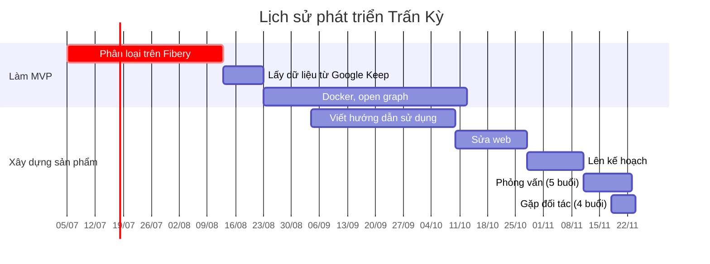

Chào mọi người,

Trong thời gian qua bọn mình đã viết [Trấn Kỳ](https://lậptrình.quảcầu.cc/%F0%9F%91%8Ftr%E1%BA%A5n%20k%E1%BB%B3/?utm_source=CW+Obsidian%2C+qu%E1%BA%A3n+l%C3%BD+d%E1%BB%B1+%C3%A1n+v%C3%A0+c%C3%B4ng+c%E1%BB%A5+ngh%C4%A9+%C2%BB+L%E1%BB%9Di+m%E1%BB%9Di+tham+gia+startup+c%E1%BB%A7a+c%E1%BB%99ng+%C4%91%E1%BB%93ng&utm_medium=vault&utm_campaign=Tr%E1%BA%A5n+K%E1%BB%B3&utm_content=ph%E1%BA%A7n+m%E1%BB%9F+%C4%91%E1%BA%A7u), một chương trình phân loại câu nhập bằng tiếng Việt tự nhiên, với mục đích là để [[Lý do viết Trấn Kỳ|giúp Kendy]]. Chương trình đã viết xong. Bọn mình nhận thấy nó còn nhiều tiềm năng để phát triển nó, và việc phát triển đó có thể giải quyết nhiều nhu cầu khác nhau, không chỉ là Kendy, nên bọn mình muốn biến nó thành một startup và viết lời mời này.

Đây là một startup vì nó phải có tăng trưởng và doanh thu, và các hoạt động của nó sẽ để làm những việc mà một người bạn sẽ làm. Trước mắt mục tiêu của nó là để hỗ trợ Kendy. Sau khi Kendy hết khó khăn rồi thì tuỳ vào quyết định của những người ở lại đến lúc đó.

# Tôi có thể giúp gì?
Đây là các công việc luôn cần người tham gia:

- [[Kế hoạch phát triển Trấn Kỳ|Lên kế hoạch phát triển]]{ .md-button .md-button--primary }
- [[Truyền thông]]{ .md-button .md-button--primary }
- [[Người cần kỷ luật tài chính]]{ .md-button .md-button--primary }
- [[Kế hoạch xây dựng cộng đồng phát triển Trấn Kỳ|Xây dựng cộng đồng phát triển Trấn Kỳ]]{ .md-button .md-button--primary }
- [[Kế hoạch tổ chức các buổi hướng dẫn sử dụng Trấn Kỳ|Tổ chức các buổi hướng dẫn người dùng sử dụng Trấn Kỳ]]{ .md-button .md-button--primary }
# Tôi có lợi gì khi tham gia?
Nhận làm bất cứ công việc nào bạn sẽ được nhận link tải Trấn Kỳ.

Ngoài ra, tuỳ thuộc vào việc bạn là ai mà bạn sẽ nhận được những lợi ích khác nhau. Xem chi tiết ở bài này: [[Giả thiết về giá trị của Trấn Kỳ]]{ .md-button .md-button--primary }

# Cách thức tham gia
Bạn có thể bắt đầu bằng việc điền [khảo sát nhu cầu phân loại tự động và lập trình](https://quảcầu.cc/khao-sat-nhu-cau-phan-loai-tu-dong-va-lap-trinh/?utm_source=CW+%C2%BB+Obsidian%2C+qu%E1%BA%A3n+l%C3%BD+d%E1%BB%B1+%C3%A1n+v%C3%A0+c%C3%B4ng+c%E1%BB%A5+ngh%C4%A9+%C2%BB+L%E1%BB%9Di+m%E1%BB%9Di+x%C3%A2y+d%E1%BB%B1ng+m%E1%BB%99t+startup+%C4%91%E1%BB%83+l%C3%A0m+nh%E1%BB%AFng+vi%E1%BB%87c+m%E1%BB%99t+ng%C6%B0%E1%BB%9Di+b%E1%BA%A1n+s%E1%BA%BD+l%C3%A0m&utm_medium=vault&utm_campaign=Tr%E1%BA%A5n+K%E1%BB%B3) này để bọn mình hiểu hơn về bạn.

Mời bạn vào Discord của Quả Cầu để thảo luận với mọi người
[Tham gia](https://discord.com/channels/898550123007709204/1163106307495170108/1171076032342806548){ .md-button .md-button--primary }

# Mô hình hoạt động
Người cần Trấn Kỳ là những người bị dày vò hằng ngày khi tất cả những giải pháp họ biết tới đều yêu cầu họ phải phân loại ngay lúc nhập dữ liệu. Trong số đó, những người có tiềm năng chi tiền nhất có lẽ là:
- Những người có một số vốn kiểu vài chục triệu để đầu tư kinh doanh, 
- Những người làm nghiên cứu hoặc làm dự án xã hội mới được cấp quỹ làm dự án

Để hỗ trợ người sử dụng Trấn Kỳ cũng như thu hút sự quan tâm của cộng đồng, [[Các buổi đáp ứng nhu cầu học cách sử dụng công cụ và tư duy lập trình cho nhu cầu cá nhân hoặc nghiên cứu]] sẽ được tổ chức. Những người cần có các buổi đó (bao gồm cả những người cần có Trấn Kỳ nhưng không có khả năng chi tiền) sẽ tham gia vào việc tổ chức chúng. Việc này đảm bảo rằng các buổi này sẽ diễn ra vào thời gian họ rảnh với nội dung được cá nhân hoá cho họ và ứng dụng được ngay vào dự án của họ. Những người tham gia các buổi này ngoài việc được đáp ứng các nhu cầu trước mắt sẽ có thêm cơ hội mở rộng mối quan hệ, kiến thức, trải nghiệm và các cơ hội khác.

Bài chi tiết: [[Hỏi đáp về việc bán Trấn Kỳ#Mô hình hoạt động là gì?|Hỏi đáp về việc bán Trấn Kỳ]]{ .md-button .md-button--primary } [[Kế hoạch|Các bản kế hoạch]]{ .md-button .md-button--primary }

Đây là những hoạt động mà một người bạn sẽ làm. Startup này chỉ chuyên nghiệp hoá chúng lên để đạt hiệu quả cao nhất mà thôi.
# Số tiền thu được sẽ dùng làm gì?
- Trả lương
- Trả lãi cho nhà đầu tư
- Hỗ trợ Kendy
