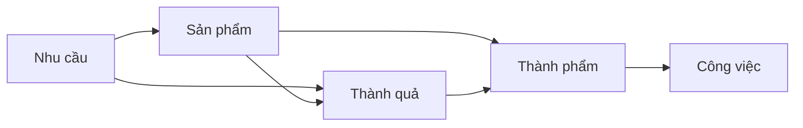

[[Nhu cầu mà có định lượng sẽ là Thành quả cần có]]
[[Thành quả là kết quả mà chúng ta thu được do sự thay đổi về hành vi của người dùng khi tương tác với sản phẩm đã được cải tiến (hoặc sản phẩm mới)]] 
Output là sản phẩm nhỏ hơn
Sự kiện là một loại output

Sản phẩm là sự bồi tụ của các dòng hải lưu nhu cầu và kết tinh của kiến thức, trong khi sản phẩm nhỏ hơn là output. Nó là lý do khiến mọi người bu vào. Sản phẩm = dự án = nhóm các output. Những outcome nào liên quan đến nhau thì sẽ là để phục vụ cho một outcome lớn hơn
Thường là để các cấp trong tổ chức nói chuyện với nhau
Tầm nhìn chắc là outcome tổng
Nhu cầu = impact = problem = why start = pain point = động lực
 

https://herbig.co/product-discovery/#