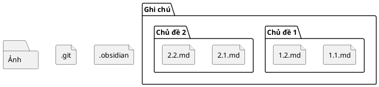

Bài viết [The Knowledge Organization](https://fibery.io/blog/gems/the-knowledge-organization/) của Fibery có nói đến việc [[Cấu trúc phân cấp thường cứng nhắc và nhân tạo|cấu trúc phân cấp của cây thư mục thường cứng nhắc và nhân tạo]]. Cùng là một tập tin, khi đang làm việc A thì đầu óc ta sẽ nghĩ đến nó với cái tên và ở cấu trúc phân cấp khác với khi đang làm việc B:
 

Bởi vì [[Obsidian lưu dữ liệu ở định dạng đơn giản]], bạn sẽ bị trói buộc vào cấu trúc phân cấp của cây thư mục. Khi bạn bắt tay viết một ghi chú, bạn sẽ muốn các tập tin hỗ trợ (ảnh, video, code, v.v.) ở trong cùng một thư mục. Nhưng đến khi số lượng ghi chú nhiều hơn, và một ảnh của bạn có thể dùng cho nhiều ghi chú khác nhau, bạn sẽ muốn tách riêng mỗi loại tập tin ra một thư mục khác nhau: ảnh ra thư mục ảnh, ghi chú ra thư mục ghi chú, v.v. Chuyện này không phải là vấn đề lớn. Nếu số lượng ảnh trong thư mục ảnh nhiều quá khó kiểm soát thì mình thường lặp lại cấu trúc ở thư mục ghi chú. VD:
```
.git
.obsidian
Ghi chú/
├── Chủ đề 1/
├── ├── Ghi chú 1.1.md
├── └── Ghi chú 1.2.md
├── Chủ đề 2/
├── ├── Ghi chú 2.1.md
└── └── Ghi chú 2.2.md
Ảnh/
├── Chủ đề 1/
└── Chủ đề 2/
```

Cũng không nhất thiết cấu trúc thư mục cho ảnh phải giống với cấu trúc cho ghi chú. Khác nhau cũng được, miễn là quản lý thuận tiện.

Rắc rối bắt đầu đến khi mình tạo ra nhiều kho dữ liệu, và mỗi ảnh có thể dùng cho 2, 3 kho. Để dùng ảnh thì mình **bắt buộc phải có ảnh trong từng kho**. Để quản lý ảnh thì mình tạo một thư mục ảnh ở ngoài thư mục kho như sau:
```
Kho/
├── Kho A/
│   ├── Ghi chú/
│   │   ├── Chủ đề A1/
│   │   └── Chủ đề A2/
│   └── Ảnh/
│       ├── Chủ đề A1/
│       └── Chủ đề A2/
└── Kho B/
    ├── Ghi chú/
    │   ├── Chủ đề B1/
    │   └── Chủ đề B2/
    └── Ảnh/
        ├── Chủ đề B1/
        └── Chủ đề B2/
Ảnh/
├── Chủ đề A1/
├── Chủ đề A2/
├── Chủ đề B1/
└── Chủ đề B2/
```

Các tập tin hỗ trợ khác mình cũng dùng cấu trúc tương tự.

Mỗi lần chỉnh sửa ảnh mình lại phải sao chép vào tất cả các thư mục còn lại. Bạn có thể dùng symbolic link, nhưng mình thấy việc tạo ra như vậy cũng lắt nhắt và không biết mình đã tạo vào những đâu. Hơn nữa [chính Obsidian cũng khuyến cáo không nên làm như vậy](https://help.obsidian.md/Files+and+folders/Symbolic+links+and+junctions "Symbolic links and junctions - Obsidian Help"). Trước mình cũng có tạo một script PowerShell để tự động sao chép[^1], nhưng do các thư mục đích trong `destList` cũng thay đổi thường xuyên, nên dạo này mình cũng chỉ sao chép bằng tay. Ảnh nào phải chỉnh quá nhiều thì mình mới chỉnh script. 

Cách tiếp cận mình nghĩ là triệt để hơn là tạo một plugin để mỗi lần kho được mở lên thì nó sẽ kiểm tra trong thư mục ảnh xem ảnh gốc có thời điểm tạo mới hơn ảnh hiện tại hay không. Nếu có thì tự động chép đè vào ảnh trên kho. Không biết là đã có ai làm cái này chưa?

1. Script PowerShell để tự động sao chép:

```PowerShell
$PROJ_NAME="C Obsidian, quản lý dự án và công cụ nghĩ" 
$destList=
    "$env:QC_CODE\Websites\$PROJ_NAME\Web chính\docs\assets\meta",
    "$env:QC_CODE\Websites\$PROJ_NAME\Debugging version\docs\assets\meta",
    "$env:QC_CODE\Installers\$PROJ_NAME\Resources",
    "$env:QC_VAULTS\$PROJ_NAME\Vault chính\Thiết lập\Ảnh"
    
# temporarily change to the correct folder
$scriptpath = $MyInvocation.MyCommand.Path
$dir = Split-Path $scriptpath
Write-host "My directory is $dir"
Push-Location $dir
    
foreach ($dest in $destList) {
    "Copy $(ls logo* -name) to $dest" 
    New-Item -ItemType Directory -Force -Path $dest\Logo | Out-Null
    copy-Item .\logo* -destination $dest\Logo
}

# now back to previous directory
Pop-Location
```

%% 
[Separation of content and presentation - Wikipedia](https://en.wikipedia.org/wiki/Separation_of_content_and_presentation)
cho nên em đổi từ area sang insights em thấy dễ xử lý với em hơn. Cái nào mang tính là kiến thức thôi thì là insight. Kiến thức thì nó độc lập với mong muốn của mình. Còn cái nào đi từ một mục tiêu cụ thể thì là project.

%%