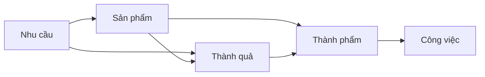

Khái niệm:: [[Quản trị kiến thức]]
Trước tiên hãy nói về cách đánh số thư mục. Cách đánh số này lấy ý tưởng từ cách đánh số [Johnny•Decimal](https://johnnydecimal.com/).
- Những sự kiện sẽ được đánh số riêng theo dạng YYMM

Nếu các file cần đánh số riêng thì sẽ có một dấu chấm

Những con số sẽ giúp nhớ

Các thư mục ở trên sẽ quyết định các thư mục ở dưới
- 1 cho bạn biết bạn muốn gì
- 2 sẽ cho bạn biết phải làm thế nào
- 3 sẽ cho bạn biết tại sao  

| Thư mục                                 | Mục tiêu                                          | Dự án phát sinh        |
| --------------------------------------- | ------------------------------------------------- | ---------------------- |
| 1 Nhu cầu                               | Cho bạn biết bạn muốn gì (what)                   | B Mạng kết nối nhu cầu |
| 2 Kỹ năng, thử thách, mức độ thành thạo | Cho bạn biết cách để đạt được điều bạn muốn (how) | C Hỗ trợ người tự học  |
| 3 Kiến thức, câu hỏi                    | Cho biết tại sao mình lại phải làm điều đó (why)  | Các sản phẩm khác                       |
- 1 sẽ là mạng kết nối nhu cầu
- 2 là hỗ trợ người tự học
- 3 sẽ là các sản phẩm khác

Từ 1 đến 3 là hướng về cá nhân, là nơi mọi người phát triển bản thân mình, là nơi họ sống cho bản thân. Từ 5 trở đi là hướng về tập thể, là những thứ được thống nhất và sử dụng chung. 4 là nơi giao nhau, và cũng có thể xem là nơi chuyển giao giữa việc đặt cá nhân làm trọng tâm và đặt tập thể làm trọng tâm. Đó là các vùng đất, nơi các dòng nhu cầu hội tụ đủ mạnh để bồi đắp tạo thành. Một người mới vào phải thấy được giá trị của 4 thì họ mới tham gia sâu hơn. Một người khi cảm thấy rằng mình muốn có 4 sẽ di chuyển xuống các thư mục ở dưới, để biến những thứ ở 4 trở thành hiện thực. 

Những người chưa có hứng thú với một vùng đất nào đó thì sẽ thấy nhức đầu bởi những chi tiết bên trong nó.

Tổ chức nằm ở 8 vì tới lúc này nhu cầu có một tổ chức mới trở nên rõ ràng hơn
Cái này là tài liệu thô mình chưa qua xử lý. Xử lý xong rồi thì để vào 9

# Phân tích từng thư mục
## Trang chủ
Nút bấm nhắc nhở mình nhìn nhận về nhu cầu của mình. Nó cũng tao cảm giác với mỗi một nhu cầu khác nhau QC sẽ biến hình để đáp ứng nhu cầu đó. 

## 1 Nhu cầu
Dẫn tới mạng lưới nhu cầu 
Phân loại theo lĩnh vực, và phân loại theo MoSCoW

Vấn đề, điểm đau
Xứ hướng làm sản phẩm hiện nay là không tập trung xây dựng chân dung khách hàng. Cái này vẫn cần thiết khi làm tiếp thị, nhưng với đội làm sản phẩm thì thiên về chân dung nỗi đau, và segment theo nhu cầu. 
## 2 Kỹ năng 
Game hóa.Nhưng nó vẫn chỉ tạo cảm giác bọc đường, là một cách để đặt mong muốn của mình lên trên. Chỉ sử dụng huy hiệu chứ không dùng tới yếu tố tuyệt vời nhất của game: bản đồ. 

Bằng việc nhận ra rằng hiểu tổ chức cũng chỉ là một kỹ năng, ta không còn cần phải sử dụng đến hệ thống cấp bậc, mà vẫn giữ được  

Nhiều khi cảm giác kỹ năng với thử thách là một. Nhưng nó sẽ khác nhau khi kỹ năng trở nên phức tạp và đòi hỏi nhiều kỹ năng nhỏ hơn, và có nhiều cấp độ tăng dần

Thử thách với đầu vào đều là những cách để tăng mức độ thành thạo kỹ năng đó. Thử thách là những công việc ở QC. Đầu vào là những công việc ko ở QC

Những tinh thần, triết lý mà tôi muốn lan tỏa, cũng chỉ là một dạng kỹ năng
Thành tựu với đầu ra là giống nhau
Ở trạng thái chưa phức tạp, mọi thứ còn hoà và nhau. Việc hiểu một khái niệm cũng có thể xem là một thử thách

Trong doanh nghiệp, mục thử thách này gọi là đào tạo nội bộ, đào tạo cho nhân viên 1 kĩ năng cần thiết nào đó. Mục mức độ thành thạo cũng có thể xem là hành trình người tham gia

Chia sẻ đam mê
Sự sẵn sàng chia sẻ thường chỉ khi họ vẫn còn đang cần. Khi hiểu rành rẽ rồi thì sự hứng thú đó cũng giảm
[[Bản đồ là yếu tố tuyệt vời nhất của game mà các dự án có sử dụng game hoá chưa sử dụng triệt để]]

Các file trong đây file nào cũng có thể là tài liệu 

Đã có rất nhiều hướng dẫn trên mạng, chỉ việc google là có rất nhiều
Kể cả khi note chưa đủ dữ liệu, và search query cũng đơn giản, thì các nút bấm cũng giảm tải sự khó khăn hơn nhiều so với phải viết ra

Mặt khác, với số lượng bài viết ê hề và cạnh tranh nhau để lên top, sẽ thấy bực mình vì

Có người giải thích ở ngay đó cũng chưa chắc thấm vì quá nhiều thuật ngữ

Template tản mát

Khi có cơ hội để học thì lại thấy nhức đầu
## 3 Kiến thức

- 31 Khái niệm, chủ đề: Các chủ đề mà QC bàn đến      
- 32 Câu hỏi: Những lỗ hổng về mặt kiến thức mà tổ chức cần tìm hiểu
- 33 Ghi chép: evergreen

Mỗi một mục sẽ chia theo những nhóm chủ đề. Để hiểu những nhóm này như thế nào thì trước hết hãy xem hình này:

![[Vòng tròn.png|300]]
Ý tưởng của hình này là:

-   [Sự bất lực học được](https://xn--riqucu-hr5aza.cc/su-bat-luc-hoc-duoc/) là chủ đề trung tâm, chi phối mọi cách tiếp cận các chủ đề khác
-   Mọi chủ đề đều liên kết với nhau, kể cả khi chúng không cùng chung nhóm
-   Mỗi một nhóm chủ đề đều có một nhóm chủ đề khác nằm lẩn sâu bên dưới, không thể giải quyết nhóm này mà không biết về nhóm kia

Theo quan sát của chúng tôi, nhiều người làm ở những nhóm chủ đề này không biết tới những nhóm chủ đề sâu hơn, còn những người làm ở những chủ đề sâu hơn thì mải miết bàn về nó mà không đưa ra được ứng dụng thực tế cho những người ở những nhóm chủ đề ở trên dùng.

Các bài viết liên quan trực tiếp tới sự bất lực học được được trình bày ở mục [Nỗi sợ, góc nhìn, mạnh mẽ, từ bi](https://xn--qucu-hr5aza.cc/category/bai-viet-sau/noi-so-goc-nhin-manh-me-tu-bi/).

Đặt:
- Nhóm 1: nhóm chủ đề bên trái sự bất lực học được, liên quan trực tiếp đến những chủ đề về bất lực hoặc thù ghét [Bất lực, bạo hành, tự quyết, can thiệp](https://xn--qucu-hr5aza.cc/category/bai-viet-sau/bat-luc-bao-hanh-tu-quyet-can-thiep/)
- Nhóm 2: nhóm chủ đề bên phải sự bất lực học được, liên quan đến những lý do khiến cho việc thù ghét hoặc bất lực trở nên có cơ sở trong văn hoá, xã hội
	- [Cái đẹp, cảm xúc, ham muốn, đam mê](https://xn--qucu-hr5aza.cc/category/bai-viet-sau/cai-dep-cam-xuc-ham-muon-dam-me/)
	- [Tự nhiên, hệ thống, khoa học, quyền uy](https://xn--qucu-hr5aza.cc/category/bai-viet-sau/tu-nhien-he-thong-khoa-hoc-quyen-uy/)
- Nhóm 3: Vòng tròn gần ngoài cùng, liên quan đến những vấn đề về nhận thức [Đạo, ngữ dụng, tâm lý học nhận thức](https://xn--qucu-hr5aza.cc/category/bai-viet-sau/dao-ngu-dung-tam-ly-hoc-nhan-thuc/)
NLP, Wikipedia 

## 4 Sản phẩm, thành quả mong muốn
Những thứ này tự nó sẽ có thể cần một vault riêng. Chúng cũng cần một trang chủ riêng 
Các sản phẩm từ dưới đếm lên là những cái bổ trợ, cần phải đi kèm với một sản phẩm cụ thể nào đó, chứ tự bản thân nó là không đủ. Và nó cũng thường đi kèm với những sản phẩm khác. 
- Tìm nguyên nhân gốc rễ: Cây vấn đề

[[Nhu cầu mà có định lượng sẽ là Thành quả cần có]]
Outcome là kết quả mà chúng ta thu được do sự thay đổi về hành vi của người
dùng khi tương tác với sản phẩm đã được cải tiến (hoặc sản phẩm mới). Thành quả cần có,
Output là sản phẩm nhỏ hơn
Sự kiện là một loại output

Sản phẩm là sự bồi tụ của các dòng hải lưu nhu cầu và kết tinh của kiến thức, trong khi sản phẩm nhỏ hơn là output. Nó là lý do khiến mọi người bu vào. Sản phẩm = dự án = nhóm các output. Những outcome nào liên quan đến nhau thì sẽ là để phục vụ cho một outcome lớn hơn
Thường là để các cấp trong tổ chức nói chuyện với nhau
Tầm nhìn chắc là outcome tổng
Nhu cầu = impact = problem = why start = pain point = động lực
 

### Sự kiện
Có những công việc dài thì để vào gantt, có những công việc ngắn
Tách ra thì sẽ lắt nhắt. Tạo nhiều note sẽ rối rắm không cần thiết

Thực chất, việc ta tư duy bằng output là vì ta tư duy bằng object

Trước đây cảm thấy rất rối, vì cùng một cái ghi chú vừa là nhu cầu, vừa là mục tiêu, vừa là sản phẩm. Tách ra thì rời rạc mà để chung thì loạn

## 5 SWOT, giá trị cốt lõi
Giá trị là cấp độ từ. Triết lý là cấp độ câu. Cả hai đều là những định hướng, la bàn, là cách đểchonj cách để ưu tiên 

Cho vào chung vì với những giá trị khác nhau sẽ cho những điểm mạnh và điểm yếu khác nhau
- Phân tích vấn đề: issue mapping
- Phân tích điểm mạnh, điểm yếu: SWOT

Do là đang đi tìm gốc rễ, nên mới để lý do :: chứ không phải Hệ quả ::. 

Những cái này sẽ chuyển sang đồ thị để xem những cái nào đang củng cố lẫn nhau

## 6 Các bên liên quan
- Thu thập thông tin người hưởng lợi: OIST
- Phân tích đối tượng thụ hưởng: tư duy thiết kế
## 7 Công việc
[[Các yếu tố trong công việc|Danh sách tất cả các tag]]

## 8 Tổ chức 
- Ra quyết định: 
# Nhìn lại lần nữa
Cách mà các khái niệm như Kỹ năng, Chủ đề, Sản phẩm mở ra (unfold) chính nó. Nghĩa là dưới nó còn có nó

Nếu chỉ một cái trong category đó thì không cần tạo folder cho đỡ rối. Nhưng nếu 2 cái trở lên mà ko tạo thì lại rối

Với việc không sử dụng khái niệm "Thành quả cần có"
 
| ---------           | Từ bắt đầu                 |
| ------------------- | -------------------------- |
| 1 Nhu cầu           | `Tìm`, `Có`, `Hiểu`        |
| 4 Thành quả cần có | `Đánh giá được`, `Có được` |
| 7 Công việc: Họp    | `Bàn`, `Thống nhất`        |
|                     |                            |

## Chiều dữ liệu: 4 và 6 tỏa đi các nơi
- Mối quan hệ giữa các dữ liệu: [RDF Triplestore](https://viblo.asia/u/huynhduc)
## 21 Hiểu QC, 4A,8+9 có chức năng giống nhau 
