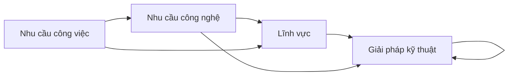

# Ý đồ thiết kế thư mục
Những gì được ghi chú trong thư mục này sẽ giúp bạn [[Làm sao để tìm được thứ cần tìm khi không biết từ khoá chính xác của nó|tìm được thứ bạn cần tìm khi không biết từ khoá chính xác của nó]].

## Tiêu chí lựa chọn
- Là những nhu cầu *phát sinh* trong quá trình làm việc, như lập trình, sức khoẻ, pháp luật, v.v. Những cái mang tính lý thuyết và thiên về việc nghĩ thì sẽ ở [[⚡Hiểu biết sâu]]
- Thường đủ phức tạp để các giải pháp làm sẵn hoặc AI không đáp ứng hiệu quả được 
- Thường xuất hiện ở các tổ chức, dự án nhỏ, vốn không có nhiều tiền để thuê ngoài
- Thường tự làm thì sẽ làm chủ động và hiệu quả hơn là để người khác làm
- Việc tự học để giải quyết nhu cầu thường tạo cảm giác bị phân tán sự tập trung khỏi công việc quan trọng hơn

## Nhận xét
Việc có hiểu biết về một lĩnh vực hoặc một giải pháp kỹ thuật sẽ giúp giải quyết các nhu cầu đòi hỏi kiến thức về lĩnh vực/giải pháp kỹ thuật đó. Nên nếu lĩnh vực/giải pháp kỹ thuật ta am hiểu càng có nhiều nhu cầu đổ về nó, thì ta sẽ càng linh hoạt hơn trong tương lai. 

## Lưu ý khác
Các giải pháp kỹ thuật chỉ là những giải pháp thường được dùng, không nhất thiết là giải pháp duy nhất.

[[Việc phân loại thư mục chỉ cần theo đúng thư mục đó, không nhất thiết phải tạo thành một cây thống nhất]]. Thư mục trong [[Nhu cầu công nghệ]] là gom các nhu cầu lại với nhau. Thư mục trong [[Lĩnh vực]] hoặc [[Giải pháp kỹ thuật]] là giải thích thông tin

Phiên bản đồ thị: 0.2. Bài chi tiết sẽ có phiên bản mới nhất cùng với các hoạt động hỗ trợ đáp ứng các nhu cầu này: https://quảcầu.cc/nhucầulậptrình.

[[Để có thể thiết kế một giải pháp một cách nhanh chóng và tự tin, ta cần được thử nghiệm ý tưởng mới và kiểm tra giả thiết ngay khi chúng vừa được nghĩ ra]] — Bret Victor, Up and Down the Ladder of Abstraction

## Một số vấn đề
Hãy xem lại sơ đồ ở trên:

Xét ghi chú [[Sắp chữ, thiết kế, xuất bản]]. Nó là một lĩnh vực. Theo sơ đồ trên, thì trong ghi chú này không nên tạo liên kết đến ghi chú về nhu cầu công nghệ. Nhưng trong lúc viết thì cảm giác rất muốn để nhu cầu công nghệ là [[WYSIWYM]], và nhu cầu công việc là [[Chèn ảnh, bảng, sơ đồ, mục lục, ghi chú, song ngữ, trích dẫn theo đúng ý]], vì chỉ thấy việc sắp chữ chỉ có cái này.

Tuy nhiên, ở một lĩnh vực khác là [[Nhân văn số|nhân văn số]], để ý là khi nghĩ về nó ta không thấy cần để nhu cầu công nghệ là [[Xác định các chủ đề có trong ngữ liệu]], và nhu cầu công việc là [[Nắm bắt xu hướng mạng]] hay [[Nghiên cứu cộng đồng mạng]], vì tự thấy rằng nhân văn số còn nhiều thứ hơn cái này.

Trong [[Giải pháp kỹ thuật]] thì có thể chia lại thư mục theo nhu cầu công việc, công nghệ hoặc lĩnh vực, vì lúc đó các ghi chú thường là rời rạc